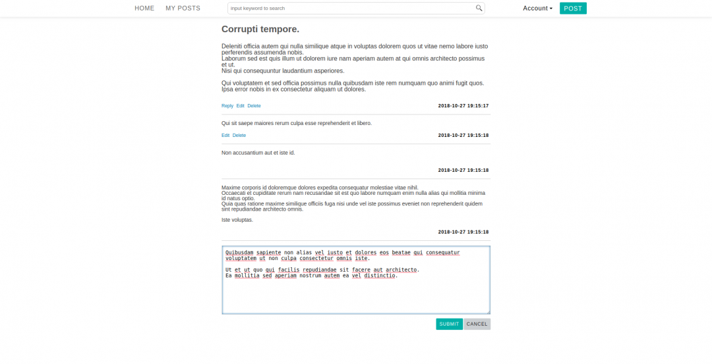

# LBBS

A tiny web application for the learning/catch-up purpose of [Rails](https://rubyonrails.org) and [React](https://reactjs.org/).  
(The name comes from `Light BBS`.)


Implemented functionalities are:

* Login mechanism based on the simple user account registration
* Submitting `posts` and `replies` as the basic function of general BBS
* Search `posts` by specific keyword (using full text search)





## How to run

(Supposed only Linux environment)
```
bundle install
rails db:migrate 

# Requires elasticsearch
docker run -d --name es -p 9200:9200 -p 9300:9300 -e "discovery.type=single-node" docker.elastic.co/elasticsearch/elasticsearch:6.4.2

# Loading test data
rails db:seed && rails searchkick:reindex:all

foreman start
```

## Spacial Thanks
https://railstutorial.org/  
https://www.sitepoint.com/react-rails-5-1/  

